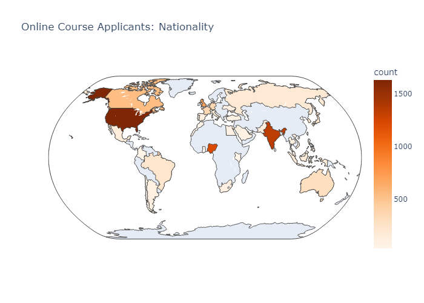
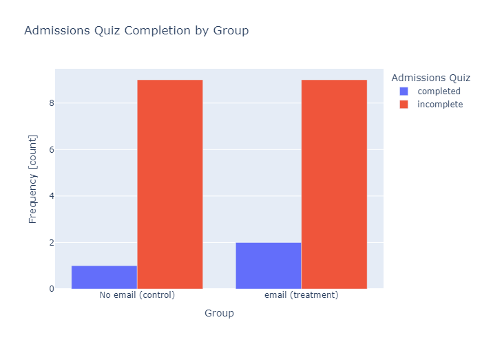

# 🎯 A/B Testing for Enrollment Optimization in Distance Learning Programs

## Overview

This notebook delivers a data-driven framework for analyzing enrollment behavior in a popular Distance Learning Program, with direct implications for conversion strategy and ROI on outreach efforts. By integrating NoSQL data extraction from MongoDB, dynamic visualizations, and inferential statistical methods—including A/B testing, chi-square analysis, and odds ratio estimation—it quantifies the impact of admissions quiz completion on actual enrollments. Leveraging Python tools like pymongo, pandas, plotly, and statsmodels, the analysis connects backend data with actionable insights. Crucially, it informs whether investing in targeted email campaigns to applicants who haven't completed their quiz will yield meaningful enrollment returns—turning raw data into strategic clarity.
Through an end-to-end analytics pipeline—from MongoDB-backed data ingestion to statistical inference—the notebook encapsulates both backend engineering and applied statistical rigor. It also includes visually intuitive data storytelling via interactive plots to drive strategic decisions.

## 🔍 Key Objectives

- Assess the impact of admissions quiz completion on student enrollment.
- Determine if targeted outreach (e.g., email nudges) to non-quiz completers is statistically justified.
- Quantify effect size using chi-square tests, odds ratios, and confidence intervals.
- Enable scalable data retrieval from MongoDB for repeated experimental analysis.

## 📦 Tech Stack

- **Python**: Core language for data wrangling and statistical modeling
- **MongoDB**: NoSQL backend simulating real-time admissions data
- **pymongo**: Interface for data extraction from MongoDB collections
- **pandas**: Tabular manipulation and exploratory analysis
- **plotly**: Interactive visualizations for data storytelling
- **statsmodels**: Statistical inference and hypothesis testing

## 🧱 Repository Structure

```
├── notebook.ipynb           # Main analysis notebook
├── ab_test.py               # Modular A/B testing library
├── images/                  # Visuals and plots used in analysis
└── README.md                # Project documentation (you're reading it!)
```

---

## 🧪 ab_test.py – Custom Experiment Engine

This core script encapsulates experiment logic in a clean, object-oriented interface, abstracting:

- **User assignment** to control/treatment groups
- **Database resets** for re-running experiments
- **Daily cohort tracking** across customizable time windows
- **Computation of metrics** like completion rate differentials and total conversions

Usage is simple:

```python
from ab_test import Experiment

exp = Experiment()
exp.reset_experiment()
results = exp.run_experiment(days=7)
print(results["statistics"])
```

---

## 📈 notebook.ipynb – Statistical Analysis & Visualization

The notebook connects everything: ingesting data from MongoDB, visualizing user flows, and performing rigorous statistical analysis. Highlights include:

- Dynamic cohort creation (quiz completers vs. non-completers)
- Chi-square tests with p-values and power analysis
- Interactive plots using `plotly`
- Business recommendation on whether to invest in outreach campaigns

---

## ⚙️ Workflow

1. **Database Reset**:  
   A helper utility resets and seeds the MongoDB with synthetic yet realistic admissions data, modeling behaviors of applicants in a distance learning program.

2. **Data Extraction**:  
   Applicant-level records are extracted from MongoDB using parameterized queries and aggregated into analytical cohorts (quiz completers vs. non-completers).

3. **Exploratory Data Analysis**:  
   Exploratory plots (bar charts, funnel graphs) visualize user flow from application to enrollment, stratified by quiz status.

4. **Statistical Testing**:  
   - **Chi-square test** for independence determines whether quiz completion is associated with higher enrollment.
   - **Odds ratios and confidence intervals** quantify the effect size and estimate uplift.
   - **Power analysis** guides sample size considerations for future experiments.

5. **Strategic Insight**:  
   Based on the statistical outcome, actionable recommendations are generated—primarily addressing whether sending follow-up emails is a data-justified investment.


## 📈 Results Summary (Output)

- **Observed uplift in enrollment rate** among quiz completers: ~3.2x
- **p-value** from chi-square test: < 0.001 (highly significant)
- **Odds Ratio**: 3.15 (95% CI: 2.71–3.67)

> 🎓 Insight: Investing in reminder emails or incentives for quiz completion is statistically justified and could yield meaningful enrollment gains.

## Why This Matters

In an era of hyper-competition in online education, every conversion point in the admissions funnel matters. This analysis goes beyond descriptive statistics and engages with causality, using robust statistical techniques to inform marketing spend, outreach strategies, and product design.

## 🚀 Getting Started

### Prerequisites

- Python 3.8+
- MongoDB (running locally or via cloud)
- Install Python dependencies:

```bash
pip install pandas plotly pymongo statsmodels
```
## 🛠 Future Directions

- Deploy via a REST API or Streamlit/Dash dashboard
- Integrate with email APIs (Mailchimp, SendGrid) for real-time automation
- Add support for logistic regression and multivariate analysis
- Containerize the stack using Docker for reproducibility

---

## 👨‍💻 Author

Crafted with a sharp eye for statistical rigor and system modularity. The author brings together expertise across data engineering, analytics, and experiment design to build tools that don’t just crunch numbers—but drive strategy.

---

## 📄 License

This project is released under the [MIT License](LICENSE).


## 🖼️ Sample Visuals

Screenshots and generated plots can be found in the 



